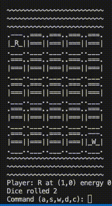

# Ritter Becken

## DEMO

Based on my son Daniel's idea for a game he invented one morning... The game rule goes as follows:
- Each player takes turn to play (no network here, we share the keyboard :D)
- Each player rolls the dice to determin how many steps he can move
- The objective is to approach and push the opponent into the water
- .. or run away from opponent
